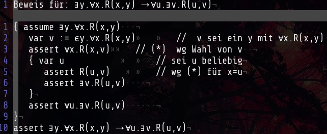
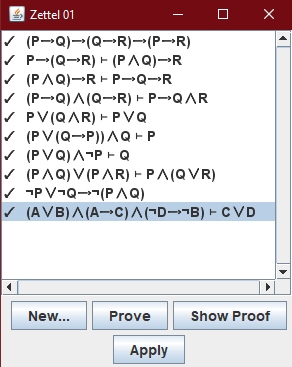

## Aufgabe 1

## Aufgabe 2

## Aufgabe 3
a.

$A \leftrightarrow A \land B \land C \land D$

$B \leftrightarrow
(A \land \neg B \land \neg C \land \neg D) \lor
(\neg A \land B \land \neg C \land \neg D) \lor
(\neg A \land \neg B \land C \land \neg D) \lor
(\neg A \land \neg B \land \neg C \land D)$

$C \leftrightarrow
(\neg D \land \neg C) \lor (\neg D \land \neg B) \lor (\neg D \land \neg A) \lor (\neg C \land \neg B) \lor (\neg C \land \neg A) \lor (\neg B \land \neg A)$

$D \leftrightarrow
\neg A \land \neg B$

b.

|Variable|true|false|
|-|-|-|
|A| | x|
|B| | x|
|C|x| |
|D|x| |

## Aufgabe 4
a. $\exists x.(istStudent(x) \land \forall y.(istAufgabe(y) \rightarrow bearbeitet(x,y)))$

b. $\forall x.(istStudent(x) \rightarrow \forall y.((istAufgabe(y) \land gibtKeinePunkte(y)) \rightarrow \neg bearbeitet(x.y)))$
c. $\exists y.(istAufgabe(y) \land \forall x.((istStudent(x) \land bearbeitet(x,y)) \rightarrow bekommtVollePunkte(x,y)))$
d. $\forall y.(istAufgabe(y) \rightarrow \exists x.(istStudent(x) \land bearbeitet(x,y) \land bekommtVollePunkte(x,y)))$
