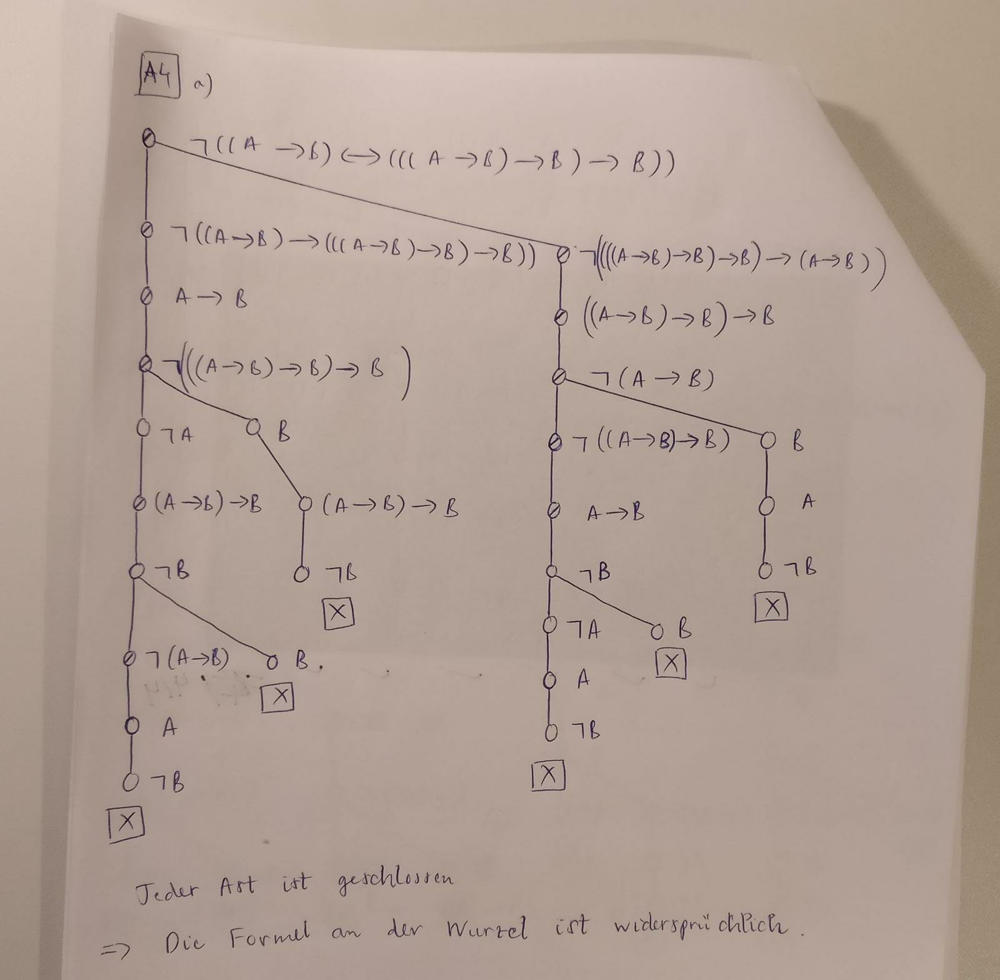
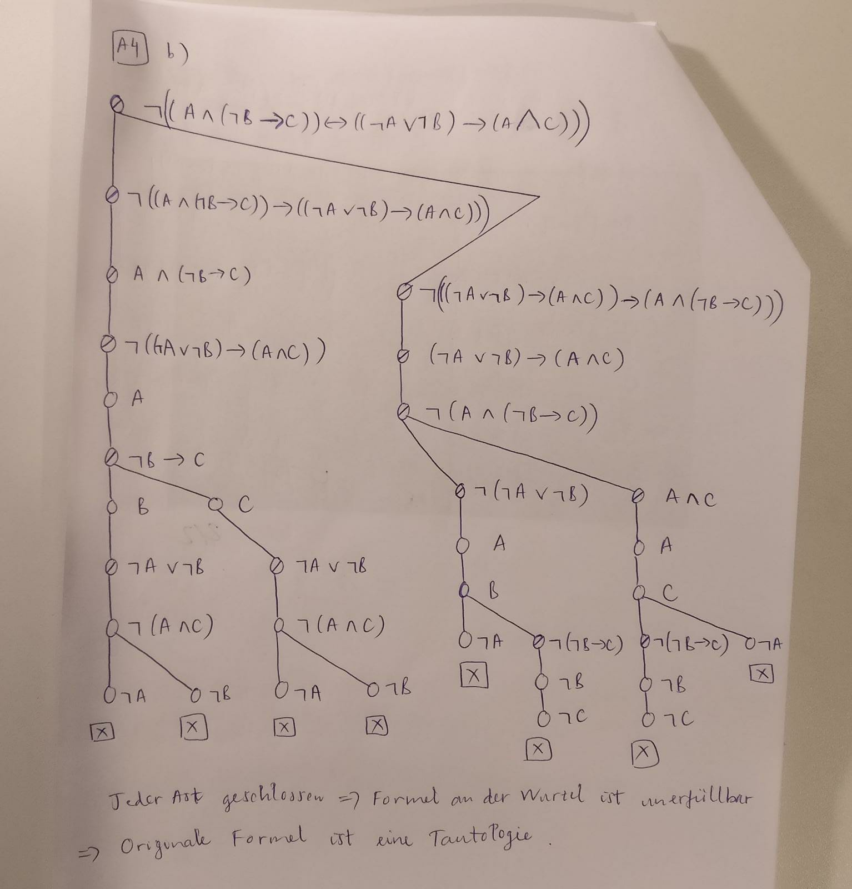

## Aufgabe 1
a. Axiom 1 von Hilbert-Kakül
b. Deduktionstheorem a
c. Axiom 3 von Hilbert-Kakül
d. Axiom 1 von Hilbert-Kakül
e. Modus Ponens c, d
f. Deduktionstheorem e
g. Modus Ponens b, f
h. Deduktionstheorem g

## Aufgabe 2
a. $\land$-Intro
b. Axiom 1
c. Modus Ponens a, b
d. Axiom 2
e. Modus Ponens e, d
f. $\land$-R
g. Modus Ponens e, f
h. Axiom 2
i. Modus Ponens, g, h
j. $\land$-L
k. Modus Ponens i, j

## Aufgabe 3
a. Zz: $\{\} \vdash \neg A \rightarrow (A \rightarrow B)$
1. $\{\} \vdash \neg A \rightarrow (\neg B \rightarrow \neg A)$ \tab //Axiom 1
2. $\{\neg A\} \vdash \neg B \rightarrow \neg A$  \tab //Deduktionstheorem 1
3. $\{\} \vdash (\neg B \rightarrow \neg A) \rightarrow (A \rightarrow B)$ \tab //Axiom 3
4. $\{\} \vdash ((\neg B \rightarrow \neg A) \rightarrow (A \rightarrow B)) \rightarrow \neg A \rightarrow ((\neg B \rightarrow \neg A) \rightarrow (A \rightarrow B))$ //Axiom 1
5. $\{\} \vdash \neg A \rightarrow ((\neg B \rightarrow \neg A) \rightarrow (A \rightarrow B))$ \tab //Modus Ponens 3, 4
6. $\{\neg A\} \vdash (\neg B \rightarrow \neg A) \rightarrow (A \rightarrow B)$ \tab //Deduktionstheorem 5
7. $\{\neg A\} \vdash A \rightarrow B$ \tab //Modus Ponens 2, 6
8. $\vdash \neg A \rightarrow (A \rightarrow B)$ \tab //Deduktionstheorem 7

b. Zz: $\vdash A \rightarrow ((A \rightarrow B) \rightarrow B)$

1. $\{\} \vdash (A \rightarrow B) \rightarrow (A \rightarrow B)$ \tab //$\vdash A \rightarrow A$ bewiesen
2. $\{\} \vdash ((A \rightarrow B) \rightarrow A \rightarrow B) \rightarrow ((A \rightarrow B) \rightarrow A) \rightarrow ((A \rightarrow B) \rightarrow B)$ //Axiom 2
3. $\{\} \vdash ((A \rightarrow B) \rightarrow A) \rightarrow ((A \rightarrow B) \rightarrow B)$ \tab //Modus Ponens 1, 2
4. $\{\} \vdash A \rightarrow ((A \rightarrow B) \rightarrow A)$ \tab //Axiom 1
5. $\{A\} \vdash (A \rightarrow B) \rightarrow A$ \tab //Deduktionstheorem 4
6. $\{A\} \vdash (A \rightarrow B) \rightarrow B$ \tab //Modus Ponens 3, 5
7. $\{\} \vdash A \rightarrow ((A \rightarrow B) \rightarrow B)$ \tab //Deduktionstheorem 6

## Aufgabe 4

\pagebreak

## Aufgabe 5

`close(Pfad,Lits)`

Die Klauseln in Zeilen 34, 35, 36 behandeln den Fall wenn das erste Element L von Pfad (der aktuelle Knoten im Baum) keine nicht-atomare Formel, sondern ein Literal ist.

- Zeile 34: Falls (und da) L schon ein Element von Lits (die Liste der bekannten Literalen) ist, muss einfach nur `close()` mit den Restknoten von Pfad und der gleichen Lits aufgerufen werden.
- Zeile 35: Falls L kein Element von Lits aber negierte L ist, und weil das erste Element von Pfad (der aktuelle Knoten) L ist, ist dieser Ast (Pfad) im Baum unerfüllbar und somit geschlossen, daher kein rekursiver Aufruf von `close()`.
- Zeile 36: Falls L und negierte L gleichzeitig nicht in Lits sind, muss L zu der Liste der bekannten Literalen Lits hinzugefügt werden und der aktuelle Pfad ist weiter zu traversieren, daher rekursiver Aufruf von `close()` mit den Restknoten von Pfad und der neuen Lits, die jetzt L enthält.

Wenn die Reihenfolge geändert würde, würde die oben beschriebene Logik hinter der Fallunterscheidung und dem Tableaukalkül verletzt und es könnte zu falschen Fälle führen, bspw. der Fall wenn L und negierte L gleichtzeitig in Lits sind trotzdem `close()` wird immer noch aufgerufen (d.h. der Pfad ist NICHT geschlossen).

